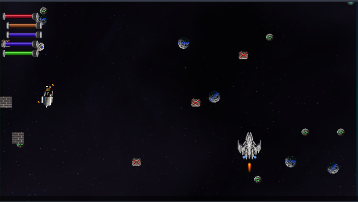
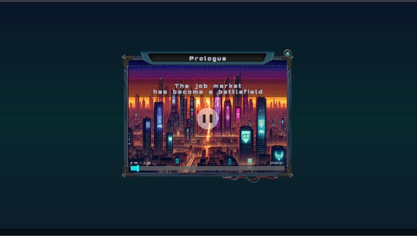
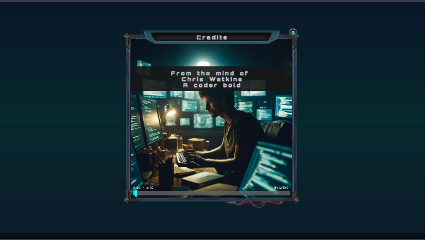
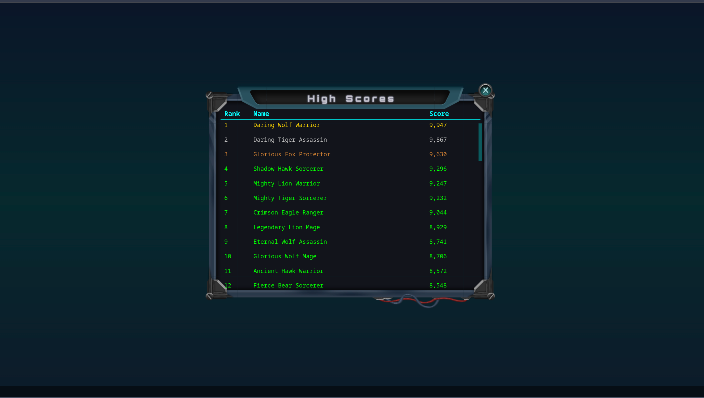

# AI Job Wars

A retro space shooter built with vanilla JavaScript and HTML5 Canvas. Classic arcade-style gameplay with cinematic cutscenes.

**Play Now: [https://aijobwars.com](https://aijobwars.com)**


## Features

- Pure JavaScript canvas rendering (no frameworks)
- Cinematic engine with timeline-based scene playback
- Modal window system with responsive viewport scaling
- Particle system for explosions and effects
- Audio manager with Web Audio API
- Boss mode (Tab key hides game with fake spreadsheet)
- Virtual viewport (1920x1080) scales to any screen size

## Screenshots

### Main Menu


### Prologue Cinematic


### Credits


### High Scores


## Controls

| Key           | Action                              |
|---------------|-------------------------------------|
| Arrow Keys    | Move ship (up/down/left/right)      |
| W/A/S/D       | Strafe                              |
| Space         | Fire lasers                         |
| Enter         | Fire missiles                       |
| Escape        | Pause                               |
| Tab           | Boss mode (fake spreadsheet)        |
| M             | Toggle sound                        |
| +/-           | Volume                              |
| F12           | Toggle frame stepping (debug)       |
| F11           | Step frame (when paused)            |

## Installation

### Local
```bash
ansible-playbook ansible/deploy.yml --tags bundle
cd html && python3 -m http.server 8000
```
Open http://localhost:8000

### Quick Play
Open `html/index.html` in a browser, or visit [https://aijobwars.com](https://aijobwars.com)

## Architecture

### Core Systems
- **Window Manager** - Modal window stack with event routing
- **Graphics** - Virtual 1920x1080 viewport with automatic scaling
- **Sprites** - Image cache with 9-slice scaling for UI
- **Audio** - Web Audio API with decoded buffer cache
- **Cinematic** - Timeline-based scene player with audio sync
- **Input** - Keyboard state tracking

### Project Structure
```
html/static/js/
├── windows/      # Modal/window system
├── ui/           # UI components
├── logic/        # Game logic
├── cinematic/    # Scene player
└── lib/          # Utils
```

### Build
```bash
# Bundle JS
ansible-playbook ansible/deploy.yml --tags bundle

# Deploy
ansible-playbook ansible/deploy.yml
```

## Attribution

### Audio
- Music: [Chiploop](https://opengameart.org/content/chiploop) by [iamoneabe](https://opengameart.org/users/iamoneabe)
- SFX: [512 8-bit Sound Effects](https://opengameart.org/content/512-sound-effects-8-bit-style) by [SubspaceAudio](https://opengameart.org/users/subspaceaudio)

### Graphics
- Spells: [Pixel Art Spells](https://opengameart.org/content/pixel-art-spells) by [DevWizard](https://opengameart.org/users/devwizard)
- Explosions: [Explosion Set 1](https://opengameart.org/content/explosion-set-1-m484-games) by [Master484](https://opengameart.org/users/master484)

### Font
- [ProFont Windows](https://www.fontsquirrel.com/fonts/profontwindows) - [License](/static/fonts/ProFont%20Redistribution%20Terms.txt)

## License

Code is open source. Assets follow their respective licenses (see attribution links).
